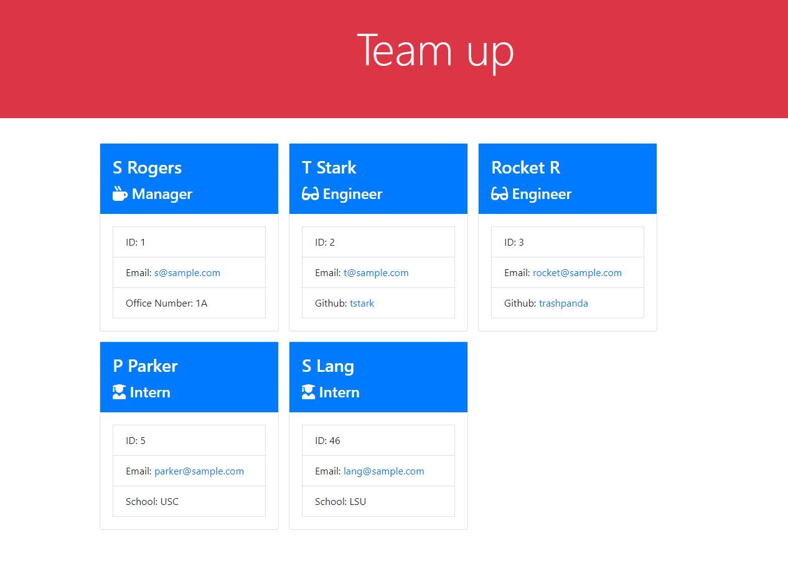

# Team Up

  

  ## Description 
  
  Team up is a command-line interface program that allows a user to enter information about their teammates so that all of the's info can be visible in one place. From the command line the user answers questions from a list of prompts. Their answers will display on a browser. The default email program for the user will open and populate their teammates email when they click on the email in the browser. If an employee has a github account the browser will open their Github profile in a new tab.

  
  
  ## Table of Contents
  
  * [Installation](#installation)
  * [Usage](#usage)
  * [Credits](#credits)
  * [License](#license)
  

  ## Installation
  
  First, have a command line interface installed on your computer. Pull the program from the GitHub repository. Install node.js on your computer.
  
  ## Usage 

  From your CLI program navigate to the root of this folder and type in 'node index.js'. From there follow the prompts.
  Video walkthrough: https://drive.google.com/file/d/12e1-Ph8i4lIpbuW543KCJ446wbZZ1Af8/view
  
   
  ## License

  Apache
  
  ## Tests

  The tests are already included in this repository. They are under the __tests__ folder.
  

  ## Questions
  If you run into any errors or have further questions about this program, you can contact here:
  
   -github: https://github.com/parkerrobison 
   
   -email: parkerobison@gmail.com.
  
  Please reference the project in question in the message. Thank you.
